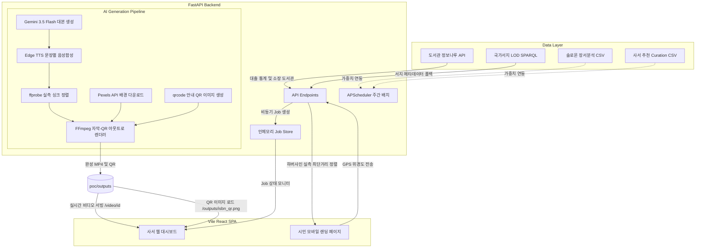

# 🏛️ Local Book-Tik Factory (로컬 북-틱 팩토리)

> **AI 기반 지역 밀착형 숏폼 북트레일러 자동 생성 및 스마트 대출 안내 플랫폼**

지역 공공도서관의 실제 대출·소장 데이터 및 사서 장서 분석 결과를 매시업하여, **단 30초~1분 만에 고품질 숏폼(9:16) 북트레일러 영상을 자동 생성**하고 시민들에게 가장 가까운 대출 가능 도서관 위치까지 QR을 통해 스마트하게 매핑해 주는 프리미엄 자동화 플랫폼입니다.

---

## 🏗️ 서비스 아키텍처



---

## 📁 주요 디렉토리 구조 및 역할

```bash
Book-Tik-Factory/
├── api/                     # FastAPI 백엔드 웹 서버
│   ├── main.py              # API 엔드포인트 설계, SPA fallback 라우팅, static 에셋 마운팅
│   ├── jobs.py              # 인메모리 백그라운드 작업 상태 관리(Store)
│   ├── scheduler.py         # APScheduler 기반 매주 월요일 자동 큐레이션 배치 스케줄러
│   └── templates/           # (레거시) 초기 프로토타입 HTML 템플릿
├── poc/                     # AI 숏폼 영상 생성 파이프라인 (Proof of Concept)
│   ├── generate.py          # [핵심] Gemini 대본 -> 문장별 TTS -> 자막 싱크 -> FFmpeg 최종 합성
│   ├── pipeline.py          # 미디어 합성 유틸리티 (배경 이미지, 오디오 길이 측정)
│   ├── enrich.py            # 정보나루 OpenAPI 연동 (인기대출도서, 소장도서관 조회)
│   ├── curate.py            # 장서분석 가중치 계산 (회전율, 숨은명저, 회전율개선 도서 추출)
│   └── outputs/             # 생성된 영상(MP4), 카드형 QR코드 이미지 저장소
└── figma_extracted/         # [프론트엔드] Figma Make 기반의 감각적인 프리미엄 UI 패키지
    ├── package.json         # React 18, Tailwind CSS v4, Vite 6 의존성 명세
    ├── vite.config.ts       # React 및 Tailwind 빌드 파이프라인 설정
    └── src/
        ├── app/
        │   ├── App.tsx      # 반응형 뷰포트(768px) 분기 처리 (모바일 ↔ PC 대시보드)
        │   └── components/
        │       ├── Dashboard.tsx      # [PC] 사서 대기열 모니터링, 수동 설명/키워드 추가 생성 컨트롤러
        │       └── MobileLanding.tsx  # [모바일] 시민이 QR 스캔 시 보이는 내 주변 최단거리 도서관 리스트
        └── styles/
            └── index.css    # 다크 초콜릿 / 민트 에코 테마 CSS 스타일 및 토큰 디자인 시스템
```

---

## 🛠️ 개발 환경 구축 및 실행 가이드

본 서비스는 무료 프로토타입 스택(비용 $0)을 기준으로 구현되어 있습니다.

### 1. 사전 필수 소프트웨어 설치 (Prerequisites)
- **Node.js**: `v18` 이상 (패키지 매니저로 `pnpm`을 적극 권장합니다).
- **Python**: `3.10` ~ `3.12` 권장.
- **FFmpeg**: 영상 합성 및 실측 길이 계산을 위해 **반드시 시스템 환경변수(Path)에 FFmpeg가 등록**되어 있어야 합니다.

### 2. 환경 변수 설정 (`.env`)
루트 경로에 `.env` 파일을 생성하고 아래 키를 입력합니다:
```env
GEMINI_API_KEY="your-gemini-api-key"
LIBRARY_API_KEY="your-data4library-api-key"  # 정보나루 OpenAPI 인증키
PEXELS_API_KEY="your-pexels-api-key"        # 배경 이미지 고화질 다운로드용 (선택)
```

---

### 3. 백엔드(FastAPI) 가상환경 설정 및 실행
의존성 충돌을 방지하고 격리된 환경에서 안전하게 서버를 실행하기 위해 파이썬 가상환경(`venv`) 사용을 강력히 권장합니다.

```bash
# 1. 가상환경 생성 (프로젝트 루트 경로에서 최초 1회 실행)
python -m venv .venv

# 2. 가상환경 활성화 (진입)
# - Windows PowerShell인 경우:
.venv\Scripts\Activate.ps1
# - Windows CMD(명령 프롬프트)인 경우:
.venv\Scripts\activate.bat
# - macOS/Linux인 경우:
source .venv/bin/activate

# 3. 격리된 가상환경에 의존성 패키지 설치
pip install -r api/requirements.txt

# 4. FastAPI 서버 기동 (포트 8000)
uvicorn api.main:app --host 127.0.0.1 --port 8000 --reload

# 5. 가상환경 종료 (서버 중단 후 가상환경을 빠져나갈 때)
deactivate
```

---

### 4. 프론트엔드(React + Tailwind v4) 설치 및 빌드
Vite를 활용해 프로덕션 정적 리소스를 빌드한 뒤 백엔드가 위치한 라우트에서 원활하게 노출되도록 서빙합니다.

```bash
# 1. 프론트엔드 디렉토리 이동
cd figma_extracted

# 2. 패키지 설치 (의존성 충돌 및 속도 저하를 피하기 위해 pnpm을 사용하세요)
pnpm install

# 3. 로컬 개발 서버 실행 (프론트 단독 디버깅용)
pnpm run dev

# 4. 백엔드 탑재용 프로덕션 빌드 (dist/ 생성)
pnpm run build
```
> [!IMPORTANT]
> `pnpm run build`를 수행하면 `figma_extracted/dist/` 디렉토리에 컴파일된 SPA 정적 자산들이 생성되며, FastAPI 백엔드가 자동으로 이를 감지하여 루트 주소 및 안내 주소로 완벽하게 서빙을 시작합니다.

---

## 💡 연동 기술 및 동작 매커니즘

### 1. AI 팩트 기반 대본 생성 및 싱크 보장 (`poc/generate.py`)
- **설정 날조(Hallucination) 방지**: LLM(Gemini)이 존재하지 않는 줄거리나 자극적인 스릴러 설정을 임의로 지어내는 것을 막기 위해 Negative Example 프롬프트 설계를 적용했습니다. 책 소개와 핵심 키워드에 충실한 고급스러운 시네마틱 감성 대본만을 뽑아냅니다.
- **WAV PCM sample-level 싱크 측정**: 글자 수 계산법은 TTS 속도 변화에 따라 자막이 누적해서 밀리는 단점이 있습니다. 본 프로젝트는 문장별로 TTS 임시 음성을 생성한 뒤 `ffprobe`로 마이크로초 단위의 WAV 실측 길이를 구하고 이를 무손실 합병함으로써, **화면 자막 싱크율 100%**를 완벽하게 보장합니다.

### 2. GPS 기반 하버사인(Harversine) 거리 안내 및 모바일 스캔 QR
- **시민용 QR 코드 안내 카드**: 숏폼 영상의 아웃트로(마지막 2.6초) 구간에는 시민들을 위한 모바일 안내 QR이 자막과 겹치지 않고 화면에 확대 노출됩니다.
- **하버사인 최단거리 정렬**: 스마트폰으로 QR을 스캔하면, 모바일 브라우저의 GPS 위치 정보 동의 시 지구 대원 거리 계산법(Harversine 공식)을 백엔드가 수행하여 **사용자에게 가장 가까운 소장 도서관 및 대출 가능 잔여 권수**를 즉석에서 실시간 정렬해 줍니다.

### 3. 주간 자동화 스케줄러 (`api/scheduler.py`)
- **APScheduler** 패키지를 내장하여 매주 자동 큐레이션 배치를 기동시킵니다.
- 대출 회전율 통계 및 사서가 올린 `solomon.csv`(장서 평가), `curation.csv`(추천 도서)의 가중치를 매치하여 숨은 명저(Type A), 도서 회전율 개선 대상(Type B), 트렌드 핫톡 화제작(Type C) 도서들을 자동으로 선정하고 숏폼 영상 생성을 스케줄링 큐에 탑재합니다.

---

## 🖥️ 주요 화면 보기 (Vite React + Tailwind CSS v4)

- **`http://localhost:8000/` (사서용 프리미엄 관리 웹 대시보드)**
  - 아름다운 브라운/골드 아웃라인 감성을 기반으로 하며 실시간 작업 상태 모니터, 대기/진행/완료/실패 개수 통계, 수동 요약 줄거리 및 키워드를 오버라이드 기입하여 숏폼 합성을 직접 명령할 수 있는 컨트롤 타워를 제공합니다. 완성된 영상의 `MP4 다운로드`, `QR 다운로드`, `유튜브 게시 설명/태그 복사` 기능이 함께 유기적으로 통합되어 작동합니다.
  
- **`http://localhost:8000/locate?isbn={ISBN}` (시민 스캔용 모바일 전용 랜딩 페이지)**
  - 모바일 해상도(768px 미만) 자동 전환을 대응하며, 싱그러운 민트/에코 베이지 톤앤매너 테마로 설계되었습니다. 실시간으로 현재 내 위치와 비교해 최적의 거리에 있는 구체적 공공도서관명 및 실시간 잔여 서고 재고 현황을 카드로 시각화하여 전달하고 길 찾기 서비스를 연동합니다.

---

## ⚖️ 라이선스 및 준수 사항
- **ATTRIBUTIONS**: [ATTRIBUTIONS.md](figma_extracted/ATTRIBUTIONS.md) 문서에 명기된 오픈소스 및 디자인 라이선스를 준수하며, 상업적 무료 및 로컬 도서관 행정망 연계 목적에 맞게 세밀하게 조율되어 있습니다.
